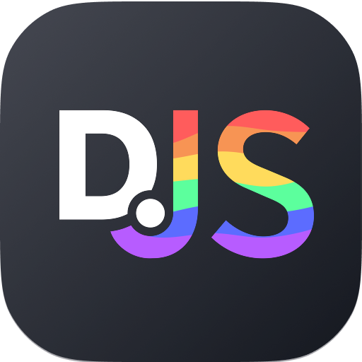

# CURSO DE DISCORDJS
👨‍⚖️DISCORD.JS É UMA BIBLIOTECA EM JAVASCRIPT QUE PERMITE INTERAGIR COM A API DO DISCORD, FACILITANDO A CRIAÇÃO DE BOTS, APLICATIVOS E INTEGRAÇÕES PARA A PLATAFORMA.

  

## CONCEITO:
Discord.js é uma biblioteca poderosa que permite aos desenvolvedores interagir com a API do Discord, facilitando a criação de bots de Discord em JavaScript/TypeScript. É amplamente utilizada para construir bots com funcionalidades variadas, desde simples comandos de texto até sistemas complexos de moderação e integração com outras APIs.

## SUA HISTÓRIA:
A biblioteca Discord.js foi criada por Amine Benkelifa em 2015. Desde então, passou por várias atualizações significativas, adaptando-se às mudanças na API do Discord e introduzindo novos recursos e melhorias de desempenho. Tornou-se uma das bibliotecas mais populares para o desenvolvimento de bots de Discord, suportada por uma comunidade ativa de desenvolvedores.

## CARACTERÍSTICAS:
### POSITIVAS:
- **Ampla Documentação:** Possui documentação extensa e bem detalhada, facilitando o aprendizado e a resolução de problemas.
- **Flexibilidade:** Permite a criação de uma ampla gama de bots, desde simples até altamente complexos, com funcionalidades personalizadas.
- **Comunidade Ativa:** Grande comunidade de desenvolvedores que contribuem com tutoriais, pacotes adicionais e suporte.
- **Integração Fácil:** Facilita a integração com outras APIs e serviços, permitindo a criação de bots que podem interagir com várias plataformas.
- **Suporte a TypeScript:** Compatível com TypeScript, permitindo um desenvolvimento mais seguro e estruturado.

### NEGATIVAS:
- **Curva de Aprendizado:** Pode ter uma curva de aprendizado íngreme para iniciantes, especialmente para aqueles que não estão familiarizados com JavaScript ou TypeScript.
- **Mudanças na API:** Alterações frequentes na API do Discord podem exigir atualizações constantes na biblioteca e no código do bot.
- **Complexidade:** Para funcionalidades avançadas, o código pode se tornar bastante complexo, exigindo um bom entendimento de conceitos de programação assíncrona e manipulação de eventos.

## SUBSIDIOS:
- [CURSO CRIADO PELO "PEDRO RICARDO - PR"](https://youtube.com/playlist?list=PLj8eMR1hXlcK4eKN8vurLSx7BtteEQuGc&si=nErtAzOrBjQAxXjo)
- [CURSO FEITO PELO VILHALVA](https://github.com/VILHALVA)
- [VEJA A DOCUMENTAÇÃO](https://discordjs.guide/#before-you-begin)
- [LINGUAGEM DE PROGRAMAÇÃO](https://github.com/VILHALVA/CURSO-DE-JAVASCRIPT)
- [TECNOLOGIA](https://github.com/VILHALVA/CURSO-DE-NODEJS)
- [VEJA O MANUAL](./MANUAL.md)
- [VEJA OS PROJETOS](https://github.com/VILHALVA?tab=repositories&q=+topic:DISCORDJS)

